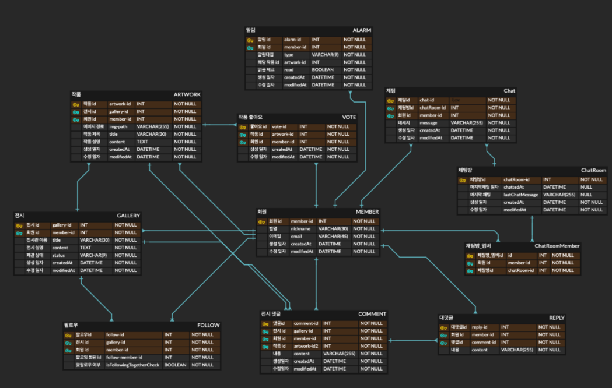

# oneyearfourcut-refactoring

코드스테이츠 메인 프로젝트의 백엔드 서버를 다시 설계해서 리팩토링하는 프로젝트입니다. 

원본 레포지토리 : https://github.com/OneYearFourCut/OneYearFourCut

## 현재 ERD

---

우선 채팅부분은 빼고 다시 설계해볼 예정

### 문제점
#### 1. 댓글이 전시회 댓글, 작품 댓글로 나뉘면서 댓글 테이블이 전시, 작품 테이블과 모두 맵핑되도록 했는데, 이렇게 하니까 구현하거나 할때 불편한 부분들이 많음

댓글 테이블이 작품 테이블만 바라보게 하고, 1번 작품 컬럼을 전시회 댓글로 따로 사용하면 되지않을까?

#### 2. 대댓글을 댓글 테이블과 따로 구현을 하셨는데 한 테이블에서 depth를 넣어 하나의 테이블로 관리하는건 안될까?